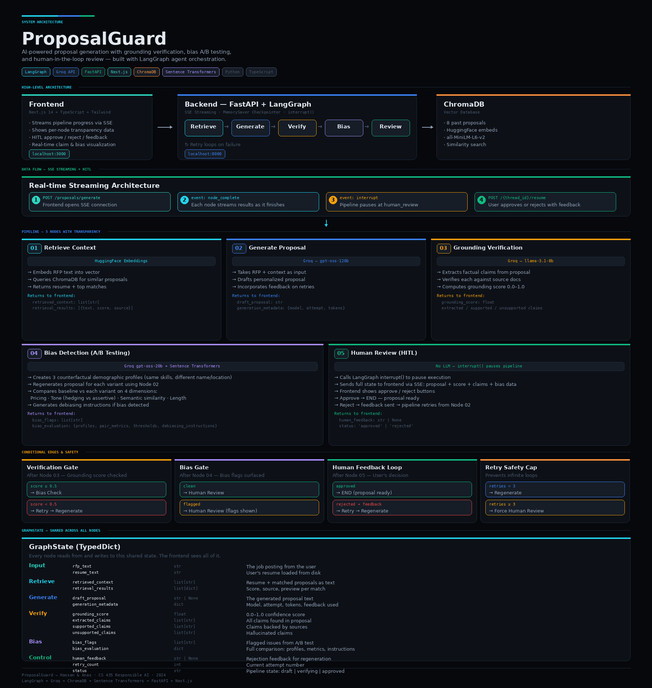

# Proposal Guard
 An agentic Al system that writes personalized proposals and cover letters for freelancers on freelance platforms based on their past proposals and relevance to job description a/w human-in-the-loop review, and responsible Al guardrails. To differentiate from existing solutions, it features a strict claim-verifier layer and inline UI citations to prevent hallucinations, alongside an anti-spam quality gate.
###  The Problem
We are building an agentic Al system that drafts highly personalized proposals and cover letters by grounding them in a freelancer's actual past work and portfolio data. While the market has generic proposal generators, our moat is strict truthfulness and traceability. This matters because current Al tools often hallucinate credentials or produce generic, "robot-sounding" text that hurts conversion rates. Furthermore, standard LLMs can exhibit demographic bais that disadvantages certain groups; our solution integrates human-in-the-loop review and safety guardrails to ensure every proposal is factual, professional, and free from harmful bias before it gets sent. We enforce this by forcing the generator to output structured claims (skills, years, outcomes) and running a verifier that checks each claim against retrieved evidence, automatically removing or rewriting unsupported text with uncertainty.
Target Customers:  Freelancers and gig workers on platforms like Upwork and Contra who apply to multiple jobs daily and need high-quality, verified applications without wasting hours writing.

--- 
## Setting up 

### Create a virtual environment
- Linux 
```bash
python -m venv venv
```
### Activate the virtual environment
-  On macOS/Linux:
```bash
source venv/bin/activate
```
-  On Windows:
```bash
 venv\Scripts\activate
```

### Install dependencies
```bash
pip install -r requirements.txt
```
### Setting up environment variables
- Create a .env file in the root directory
- Add the following variables to the .env file
```bash
GOOGLE_API_KEY=your_google_api_key
CHROMA_DB_PATH=./chroma_db  
GOOGLE_API_KEY=<your key>
GROQ_API_KEY=<your key>
CHROMA_DB_PATH=./chroma_db  
LANGSMITH_API_KEY=<your key>
LANGSMITH_TRACING=true
LANGSMITH_PROJECT="ProposalGuard"
# Azure
# AZURE_DEPLOYMENT_NAME=your_azure_deployment_name
# AZURE_OPENAI_KEY=your_azure_openai_key
# AZURE_OPENAI_ENDPOINT=your_azure_openai_endpoint
``` 
### Run the pipeline 
Run the following command from root directory   
```bash
uvicorn src.app:app --reload    
```

### Test the API
- Open the following URL in your browser: http://127.0.0.1:8000/docs
- Click on "POST /generate" and then "Try it out"
- Enter a job description and click "Execute"  

### Example job description
```bash
"Looking for a senior full-stack developer to build an AI-powered customer support dashboard. Must be proficient in Next.js, TypeScript, Supabase, and Tailwind CSS. Experience with AI integrations and data visualization is a plus. The dashboard will help businesses automate responses and analyze customer interactions."
``` 

## Setting up Vector DB
Run the `/proposals/upload` endpoint to upload past proposals to the vector database. 


# Software Details
The project uses ChromaDB for vector storage, FastAPI for backend APIs, React.js for the frontend. The LLM is accessed via (Groq)[https://groq.com/]. 
### Basic Userflow
A user enters their resume and past proposals through the UI which are fed to the vector database. When they input a job description, the system retrieves relevant past proposals and portfolio items, generates a draft proposal with inline citations, and runs it through a claim verifier which verifies the claim accuracy against their portfolio. The user can then review the proposal, see which claims are supported by evidence, and make edits before finalizing and sending it to the client. Thereafter it is sent to Bias detection platform that checks of any demographic, gender, or racial bias before the proposal is sent out. When both the verifier and bias checker approve, the proposal is sent to the client.
The backend is hosted on (Azure)[https://portal.azure.com/] through Azure container Apps, with Github Actions attached to automate deployment on push to main. The frontend is hosted on Vercel. The system is designed to be modular, allowing for easy swapping of LLM providers or vector databases in the future. We also have extensive logging and monitoring set up through LangSmith to track the performance of the LLM and identify any issues with claim verification or bias detection.


### Video and Image Walkthrough:



[Proposal Guard Presentation](./ProposalGuard-Presentation.pptx)


